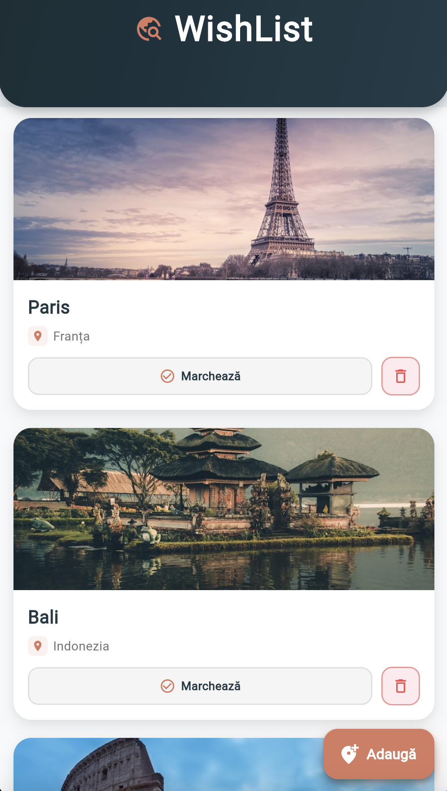
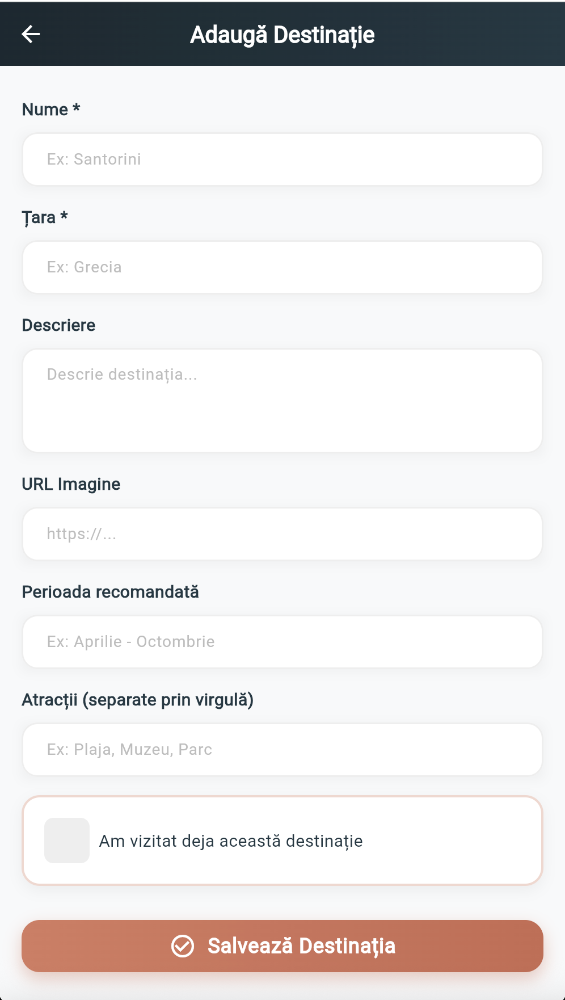
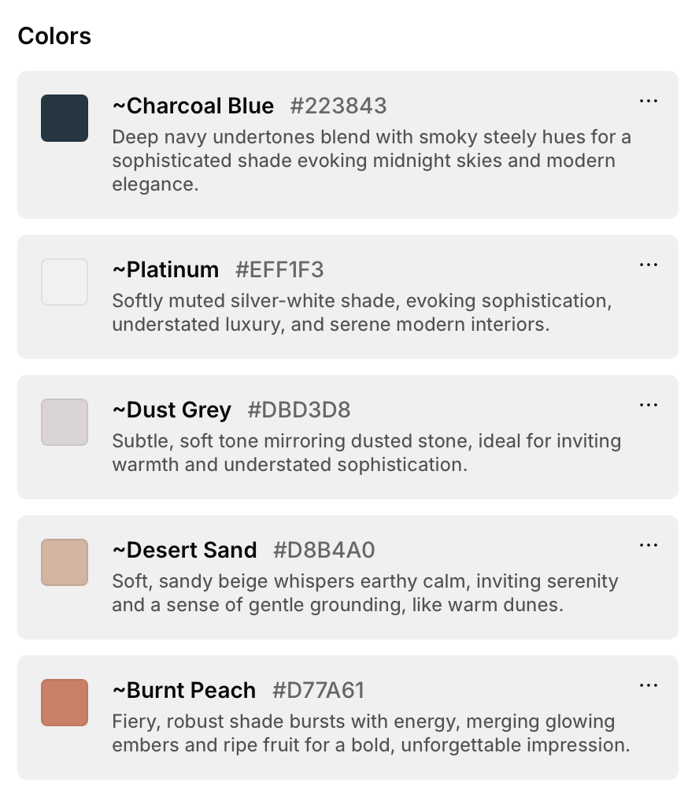

# 🌍 WishList - Aplicație de Gestionare Destinații de Călătorie

O aplicație Flutter modernă și elegantă pentru gestionarea destinațiilor tale de vis. Organizează-ți lista de călătorii, marchează destinațiile vizitate și planifică-ți următoarele aventuri!

## 📸 Screenshot-uri

<div align="center">
  
  
</div>

<div align="center">
  
  <p><em>Paleta de culori folosită în aplicație</em></p>
</div>

## ✨ Funcționalități

### 🏠 Ecran Principal
- **Listă elegantă de destinații** - Vizualizează toate destinațiile tale într-un design modern cu card-uri
- **Badge-uri pentru destinații vizitate** - Marchează vizual destinațiile pe care le-ai vizitat deja
- **Ștergere rapidă** - Elimină destinațiile cu un singur tap
- **Ecran gol frumos** - Mesaj motivațional când lista este goală
- **Floating Action Button** - Adaugă rapid destinații noi

### 📝 Adaugă Destinații
- **Formular intuitiv** cu validare
- Câmpuri pentru:
  - Nume destinație (obligatoriu)
  - Țară (obligatoriu)
  - Descriere detaliată
  - URL imagine
  - Perioada recomandată de vizitare
  - Atracții turistice (separate prin virgulă)
- **Checkbox pentru destinații vizitate** - Marchează destinațiile deja vizitate
- **Design responsive** - Funcționează perfect pe orice dimensiune de ecran

### 🗺️ Detalii Destinație
- **Imagine hero full-screen** cu overlay gradient
- **Informații complete** despre destinație
- **Card pentru perioada recomandată** - Vizualizează când e cel mai bun moment să vizitezi
- **Lista de atracții turistice** - Card-uri individuale pentru fiecare atracție
- **Buton back elegant** - Navigare ușoară înapoi la listă

### 🌍 Destinații Predefinite
Aplicația vine cu o listă de destinații exemple pentru a demonstra funcționalitățile:
- **Santorini, Grecia** - Insula vulcanică cu case albe și apusuri spectaculoase
- **Bali, Indonezia** - Paradis tropical cu temple și plaje exotice
- **Paris, Franța** - Orașul luminilor cu Turnul Eiffel și artă
- **Kyoto, Japonia** - Orașe cu temple antice și grădini zen
- **Machu Picchu, Peru** - Cetate incașă în munți
- **Islanda** - Peisaje vulcanice și aurora boreală

## 🎨 Design

### Paleta de Culori
- **Albastru închis**: `#223843` - Culoare primară pentru header și text
- **Coral/Orange**: `#D77A61` - Culoare accent pentru butoane și highlight-uri
- **Background**: `#F8F9FA` - Gri foarte deschis pentru fundal
- **Card-uri**: Alb cu shadow-uri subtile

### Caracteristici de Design
- **Gradiente moderne** pe AppBar și butoane
- **Shadow-uri soft** pentru depth și dimensiune
- **Colțuri rotunjite** pentru un aspect prietenos
- **Animații Hero** pentru tranziții fluide între ecrane
- **InkWell effects** pentru feedback vizual la tap
- **Tipografie ierarhică** pentru lizibilitate

## 🛠️ Tehnologii Utilizate

- **Flutter** - Framework UI cross-platform
- **Dart** - Limbaj de programare
- **Material Design** - Sistem de design Google
- **Stateful Widgets** - Gestionarea stării aplicației

## 📱 Platforme Suportate

- ✅ Android
- ✅ iOS
- ✅ Web
- ✅ Windows
- ✅ macOS
- ✅ Linux

## 🚀 Instalare și Rulare

### Cerințe preliminare
- Flutter SDK (3.10.4 sau mai nou)
- Dart SDK
- Android Studio / Xcode / VS Code
- Emulator sau dispozitiv fizic

### Pași de instalare

1. **Clonează repository-ul**
```bash
git clone https://github.com/username/flutter_application_1.git
cd flutter_application_1
```

2. **Instalează dependențele**
```bash
flutter pub get
```

3. **Rulează aplicația**
```bash
flutter run
```

### Build pentru producție

#### Android
```bash
flutter build apk --release
# sau pentru App Bundle
flutter build appbundle --release
```

#### iOS
```bash
flutter build ios --release
```

#### Web
```bash
flutter build web --release
```

## 📂 Structura Proiectului

```
lib/
├── main.dart                          # Entry point al aplicației
├── models/
│   └── destination.dart              # Model de date pentru destinații
├── data/
│   └── destination_data.dart         # Date mock pentru destinații
├── screens/
│   ├── home_screen.dart              # Ecranul principal cu lista
│   ├── destination_detail_screen.dart # Ecranul de detalii
│   └── add_destination_screen.dart    # Ecranul de adăugare
└── widgets/
    └── destination_card.dart          # Widget reutilizabil pentru card-uri

assets/
├── home.png                          # Screenshot ecran principal
├── adauga.png                        # Screenshot ecran adăugare
└── culori.png                        # Paletă de culori

fonts/
└── Frijole-Regular.ttf              # Font custom pentru titlu
```

## 🎯 Funcționalități Viitoare

- [ ] Persistență date cu SQLite sau Hive
- [ ] Integrare cu API-uri de călătorie (TripAdvisor, Google Places)
- [ ] Filtrare și sortare destinații
- [ ] Căutare în listă
- [ ] Export/Import liste (JSON, CSV)
- [ ] Notificări pentru călătorii planificate
- [ ] Integrare calendar
- [ ] Partajare destinații pe social media
- [ ] Mode întunecat (Dark mode)
- [ ] Localizare multi-limbă
- [ ] Backup cloud (Firebase, iCloud)
- [ ] Hartă interactivă cu toate destinațiile

## 📝 Licență

Acest proiect este creat în scop educațional.

## 👤 Autor

Creat cu ❤️ folosind Flutter

## 🤝 Contribuții

Contribuțiile sunt binevenite! Pentru schimbări majore, deschide mai întâi un issue pentru a discuta ce ai dori să schimbi.

## 📞 Contact

Pentru întrebări sau sugestii, nu ezita să deschizi un issue pe GitHub.

---

**Enjoy your travels! 🌎✈️**
