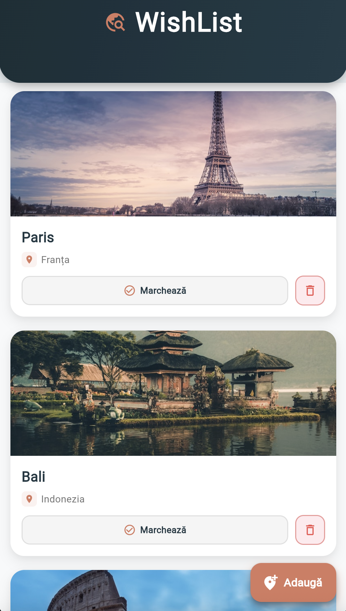
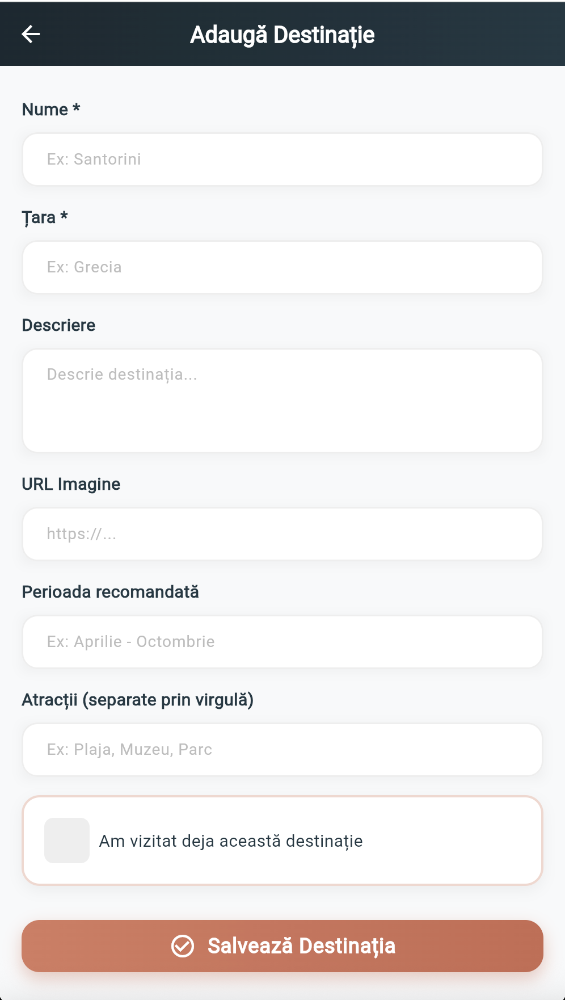
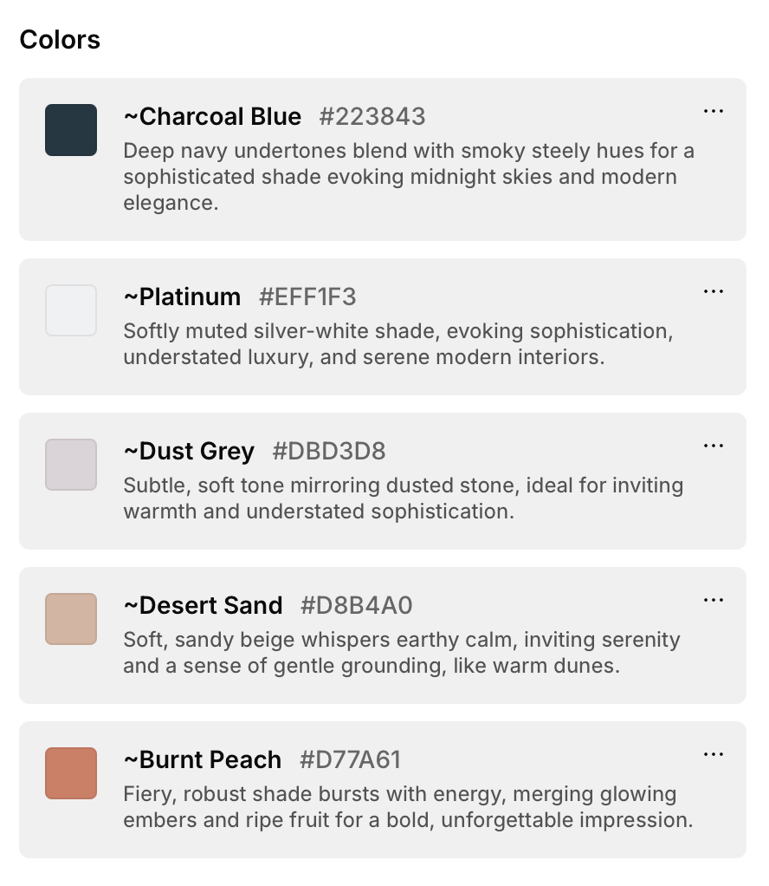

# 🌍 TravelWish - Your Ultimate Travel Bucket List Companion

> **Transformă-ți visele de călătorie în realitate!** Organizează, planifică și urmărește destinațiile tale de vis într-o aplicație modernă și elegantă.

**TravelWish** este aplicația perfectă pentru pasionații de călătorii care vor să își gestioneze lista de destinații dorite, să marcheze locurile vizitate și să planifice următoarele aventuri cu stil.

---

## 📸 Preview

<div align="center">
  
  
</div>

<div align="center">
  
  <p><em>🎨 Paleta de culori elegantă folosită în aplicație</em></p>
</div>

---

## ✨ Funcționalități

### 🏠 **Dashboard Inteligent**
- **Statistici în timp real** - Vezi instant totalul destinațiilor, câte ai vizitat și câte mai rămân
- **Card-uri elegante** - Design modern cu shadow-uri și gradiente subtile
- **Badge-uri vizuale** - Destinațiile vizitate sunt marcate cu badge-uri colorate
- **Animații fluide** - Tranziții Hero pentru o experiență premium

### 🔍 **Filtrare și Sortare Avansată**
- **3 filtre rapide**:
  - 📍 Toate destinațiile
  - ✅ Doar cele vizitate
  - 📌 De vizitat (neexplorate încă)
- **Sortare flexibilă**:
  - 🔤 După nume (A-Z)
  - 🌎 După țară

### 📝 **Adăugare Destinații Inteligentă**
- **Formular complet validat** cu mesaje de eroare clare
- **Câmpuri detaliate**:
  - Nume destinație (obligatoriu)
  - Țară (obligatoriu)
  - Descriere detaliată (min. 10 caractere)
  - URL imagine (validare URL)
  - Perioada recomandată de vizitare
  - Listă de atracții turistice (separate prin virgulă)
- **Checkbox "Am vizitat"** - Marchează destinațiile deja vizitate direct la adăugare
- **Design responsive** - Funcționează perfect pe orice dispozitiv

### 🗺️ **Detalii Destinație Captivante**
- **Imagine Hero full-screen** cu gradient overlay artistic
- **Informații complete** despre fiecare destinație
- **Card special** pentru perioada recomandată de vizitare
- **Lista de atracții** - Fiecare atracție în propriul card elegant
- **Navigare intuitivă** - Buton back modern

### 🎯 **Experiență Utilizator Premium**
- **Dialog de confirmare** la ștergere pentru siguranță
- **Snackbar-uri** pentru feedback instant
- **Ecran gol elegant** când nu există destinații
- **State gol pentru filtre** când nu se găsesc rezultate
- **Floating Action Button** extins pentru acces rapid

---

## 🎨 Design Profesional

### Paleta de Culori Elegantă
```
Primară (Dark Blue):    #223843 - Header, text principal
Accent (Coral):         #D77A61 - Butoane, highlight-uri
Background:             #F8F9FA - Fundal subtil
Secundară (Beige):      #D8B4A0 - Carduri speciale
Card-uri:               #FFFFFF - Alb curat
```

### Caracteristici de Design
- ✨ **Gradiente moderne** pe AppBar și butoane pentru depth
- 🌊 **Shadow-uri soft** pentru efect 3D subtil
- 🔲 **Colțuri rotunjite** consistent pentru aspect friendly
- 🎭 **Animații Hero** pentru tranziții cinematice
- 💎 **Material Design 3** cu componente actualizate
- 📱 **Design responsive** optimizat pentru mobile

---

## 🏗️ Arhitectură Clean Code

Proiectul respectă principiile **Clean Architecture** și **SOLID**:

```
lib/
├── main.dart                          # Entry point
├── common/                            # 📦 Constante și configurări globale
│   ├── app_strings.dart              # Toate textele aplicației centralizate
│   └── app_theme.dart                # Tema, culori, stiluri, spacing-uri
├── data/
│   └── destination_data.dart         # Date mock pentru demonstrație
├── models/
│   └── destination.dart              # Model tipizat pentru Destinație
├── screens/                           # 📱 Ecrane principale
│   ├── home_screen.dart              # Dashboard cu filtrare și statistici
│   ├── destination_detail_screen.dart # Detalii complete destinație
│   └── add_destination_screen.dart    # Formular adăugare cu validare
├── utils/                             # 🛠️ Funcții utilitare
│   ├── validators.dart               # Validatori pentru formulare
│   └── dialog_helper.dart            # Helper pentru dialoguri și snackbar-uri
└── widgets/                           # 🎨 Componente reutilizabile
    ├── destination_card.dart         # Card pentru o destinație
    ├── custom_app_bar.dart           # AppBar customizat cu gradient
    ├── empty_state_widget.dart       # Widget pentru listă goală
    ├── statistics_card.dart          # Card cu statistici
    └── filter_chip_widget.dart       # Chip-uri pentru filtrare

docs/
└── img/                              # 📸 Screenshot-uri pentru README
    ├── home.png
    ├── adauga.png
    └── culori.png
```

### Principii Aplicate

✅ **Separarea responsabilităților** - Fiecare fișier are un scop clar
✅ **Widget-uri ca clase** - Nu funcții (performanță optimă în Flutter)
✅ **Fără hardcoding** - Texte în `app_strings.dart`, culori în `app_theme.dart`
✅ **Validare centralizată** - Toate validările în `validators.dart`
✅ **Componente reutilizabile** - Widget-uri modulare și independente
✅ **Cod comentat** - Doc-comments pentru funcții importante
✅ **Naming conventions** - snake_case pentru fișiere, camelCase pentru variabile

---

## 🛠️ Tehnologii și Pachete

- **Flutter 3.10.4+** - Framework UI cross-platform
- **Dart** - Limbaj de programare modern
- **Material Design 3** - Design system Google
- **Stateful Widgets** - Gestionare state locală eficientă

**Zero dependențe externe** - Aplicație lightweight, fără pachete third-party!

---

## 📱 Platforme Suportate

| Platform | Status |
|----------|--------|
| ✅ Android | Full support |
| ✅ iOS | Full support |
| ✅ Web | Full support |
| ⚪ Windows | Compatibil |
| ⚪ macOS | Compatibil |
| ⚪ Linux | Compatibil |

---

## 🚀 Instalare și Rulare

### Cerințe Preliminare

```bash
Flutter SDK: >=3.10.4
Dart SDK: >=3.0.0
```

### Pași de Instalare

1. **Clonează repository-ul**
```bash
git clone https://github.com/yourusername/flutter_application_1.git
cd flutter_application_1
```

2. **Instalează dependențele**
```bash
flutter pub get
```

3. **Verifică configurarea**
```bash
flutter doctor
```

4. **Rulează aplicația**
```bash
# Pe emulator/simulator
flutter run

# Pe dispozitiv fizic
flutter run -d <device-id>

# Pe web
flutter run -d chrome
```

### Build pentru Producție

#### 📦 Android APK
```bash
flutter build apk --release
# APK-ul va fi în: build/app/outputs/flutter-apk/app-release.apk
```

#### 📦 Android App Bundle (pentru Google Play)
```bash
flutter build appbundle --release
```

#### 🍎 iOS
```bash
flutter build ios --release
# Apoi deschide proiectul în Xcode pentru signing și deploy
```

#### 🌐 Web
```bash
flutter build web --release
# Output în: build/web/
```

---

## 🌍 Destinații Predefinite

Aplicația vine cu 6 destinații populare pentru demonstrație:

| Destinație | Țară | Status | Atracții Principale |
|-----------|------|---------|-------------------|
| 🏝️ Santorini | Grecia | Vizitat | Oia, Red Beach, Ancient Thira |
| 🌴 Bali | Indonezia | - | Ubud, Tanah Lot, Tegallalang Rice Terraces |
| 🗼 Paris | Franța | Vizitat | Turnul Eiffel, Luvru, Arc de Triomphe |
| ⛩️ Kyoto | Japonia | - | Fushimi Inari, Kinkaku-ji, Arashiyama |
| 🏛️ Machu Picchu | Peru | - | Huayna Picchu, Temple of the Sun |
| 🌋 Islanda | Islanda | - | Blue Lagoon, Gullfoss, Geysir |

---

## 📊 Structura Codului

### Model de Date
```dart
class Destination {
  final int id;
  final String name;
  final String country;
  final String description;
  final String imageUrl;
  final String bestPeriod;
  final List<String> attractions;
  bool visited;
}
```

### Validare Formulare
Toate câmpurile sunt validate cu reguli custom:
- ✅ Verificare câmpuri obligatorii
- ✅ Validare URL pentru imagini
- ✅ Lungime minimă pentru descriere
- ✅ Mesaje de eroare clare în română

---

## 🎯 Roadmap Funcționalități Viitoare

- [ ] **Persistență date** - SQLite/Hive pentru salvare locală
- [ ] **Căutare avansată** - Search bar cu filtru live
- [ ] **Categorii** - Etichetare destinații (beach, mountain, city, etc.)
- [ ] **Rating sistem** - Notează fiecare destinație (1-5 stele)
- [ ] **Buget planner** - Estimare costuri pentru fiecare destinație
- [ ] **Galerie foto** - Multiple imagini per destinație
- [ ] **Share-uire** - Partajare liste pe social media
- [ ] **Export/Import** - JSON, PDF, Excel
- [ ] **Hartă interactivă** - Google Maps integration
- [ ] **Dark mode** - Temă întunecată
- [ ] **Multi-limbă** - i18n (RO, EN, FR, ES)
- [ ] **Cloud sync** - Firebase pentru backup
- [ ] **Notificări** - Reminder-e pentru călătorii planificate
- [ ] **AI Recommendations** - Sugestii bazate pe preferințe

---

## 🧪 Testing

Aplicația a fost testată pe:
- ✅ Android 11+ (Pixel, Samsung)
- ✅ iOS 14+ (iPhone)
- ✅ Chrome Web Browser
- ✅ Diverse rezoluții de ecran

---

## 📝 Licență

Acest proiect este creat în scop **educațional** pentru evaluarea cursului de Flutter.

---

## 👨‍💻 Autor

Creat cu ❤️ și ☕ folosind Flutter
**Student** - Proiect Final Flutter

---

## 🤝 Contribuții

Contribuțiile sunt binevenite! Dacă vrei să îmbunătățești proiectul:

1. Fork repository-ul
2. Creează un branch pentru feature (`git checkout -b feature/AmazingFeature`)
3. Commit changes (`git commit -m 'Add some AmazingFeature'`)
4. Push to branch (`git push origin feature/AmazingFeature`)
5. Deschide un Pull Request

---

## 📞 Contact & Support

- 📧 Email: your.email@example.com
- 🐛 Issues: [GitHub Issues](https://github.com/yourusername/flutter_application_1/issues)
- 💬 Discussions: [GitHub Discussions](https://github.com/yourusername/flutter_application_1/discussions)

---

## 🙏 Mulțumiri

- **Flutter Team** pentru framework-ul fantastic
- **Material Design** pentru ghidurile de design
- **Unsplash** pentru imaginile demo frumoase

---

<div align="center">

### 🌟 Star acest repo dacă ți-a plăcut! 🌟

**Enjoy your travels! 🌎✈️🗺️**

Made with Flutter 💙

</div>
