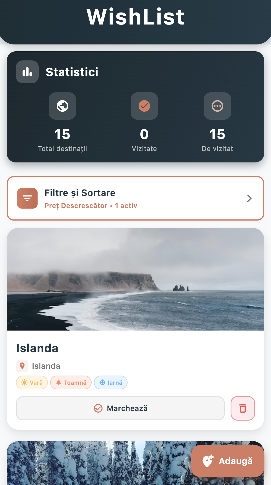
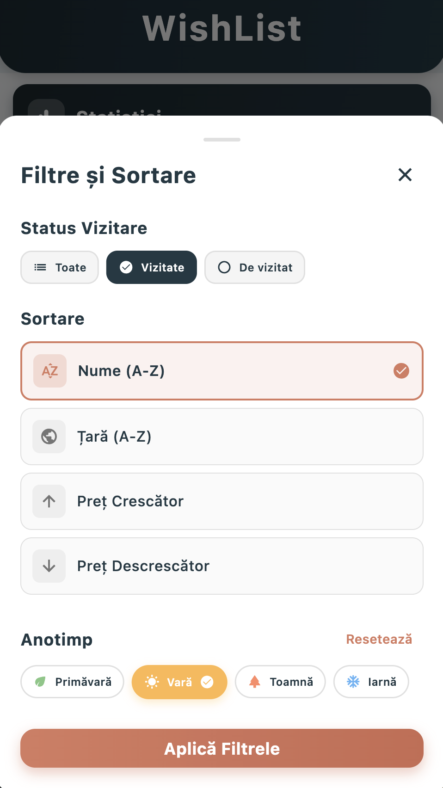
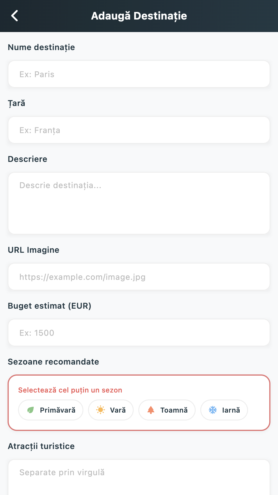

# 🌍 WishList - Aplicație Personală pentru Planificarea Călătoriilor

Aplicație Flutter pentru gestionarea destinațiilor de călătorie, cu filtrare după sezoane și buget.

---

## 📸 Preview

<div align="center">
  
  
</div>

<div align="center">
  
  
</div>

---

## ✨ Funcționalități

### 🏠 Ecran Principal
- **Ecran de Welcome** cu prezentarea aplicației
- **Statistici** - Total destinații, vizitate, rămase
- **Filtre și Sortare** într-un pop-up elegant:
  - Filtrare: Toate / Vizitate / De vizitat
  - Sortare: Nume / Țară / Preț Crescător / Descrescător
  - Filtrare după Anotimp (multiple: Primăvară, Vară, Toamnă, Iarnă)

### 📝 Adăugare Destinații
- Formular complet cu validare
- Câmpuri: Nume, Țară, Descriere, Imagine, Buget, Sezoane, Atracții
- Selector multi-sezon cu chip-uri colorate
- Checkbox pentru destinații deja vizitate

### 🗺️ Detalii Destinație
- Imagine full-screen
- Sezoane recomandate cu iconițe colorate
- Buget estimat
- Lista de atracții turistice

### 🎯 Experiență Utilizator
- Imagini locale din assets
- Dialog de confirmare la ștergere
- Design responsive
- Animații fluide

---

## 🏗️ Structură Proiect

```
lib/
├── main.dart
├── common/
│   ├── app_strings.dart        # Toate textele centralizate
│   └── app_theme.dart          # Culori, stiluri, spacing
├── data/
│   └── destination_data.dart   # 15 destinații predefinite
├── models/
│   └── destination.dart        # Model cu seasons + budget
├── screens/
│   ├── welcome_screen.dart     # Ecran de bun venit
│   ├── home_screen.dart        # Dashboard cu filtrare
│   ├── destination_detail_screen.dart
│   └── add_destination_screen.dart
├── utils/
│   ├── validators.dart         # Validatori pentru formulare
│   └── dialog_helper.dart
└── widgets/
    ├── destination_card.dart
    ├── custom_app_bar.dart
    ├── filter_sort_bottom_sheet.dart  # Pop-up filtre
    ├── empty_state_widget.dart
    └── statistics_card.dart
```

---

## 🎨 Design

### Paleta de Culori
```
Primară (Dark Blue):    #223843
Accent (Coral):         #D77A61
Background:             #F8F9FA
Secundară (Beige):      #D8B4A0
```

### Caracteristici
- Gradiente moderne
- Shadow-uri soft
- Material Design 3
- Animații Hero
- Design responsive

---

## 🌍 Destinații Incluse

15 destinații populare cu imagini locale:
- Santorini (Grecia) - €1200
- Paris (Franța) - €900
- Bali (Indonezia) - €1500
- Roma (Italia) - €850
- Tokyo (Japonia) - €2100
- Praga (Cehia) - €650 (cel mai ieftin)
- Islanda - €1800
- Barcelona (Spania) - €800
- Machu Picchu (Peru) - €2400 (cel mai scump)
- Amsterdam (Olanda) - €950
- Laponia (Finlanda) - €1600
- Dubai (Emirate) - €1400
- Lisabona (Portugalia) - €700
- Viena (Austria) - €900
- Croația - €850

---

## 🚀 Instalare și Rulare

### Cerințe
```bash
Flutter SDK: >=3.10.4
Dart SDK: >=3.0.0
```

### Pași

1. **Instalează dependențele**
```bash
flutter pub get
```

2. **Rulează aplicația**
```bash
flutter run
```

3. **Build pentru producție**
```bash
# Android
flutter build apk --release

# iOS
flutter build ios --release

# Web
flutter build web --release
```

---

## 🌍 Destinații Predefinite

Aplicația vine cu 6 destinații populare pentru demonstrație:

| Destinație | Țară | Status | Atracții Principale |
|-----------|------|---------|-------------------|
| 🏝️ Santorini | Grecia | Vizitat | Oia, Red Beach, Ancient Thira |
| 🌴 Bali | Indonezia | - | Ubud, Tanah Lot, Tegallalang Rice Terraces |
| 🗼 Paris | Franța | Vizitat | Turnul Eiffel, Luvru, Arc de Triomphe |
| ⛩️ Kyoto | Japonia | - | Fushimi Inari, Kinkaku-ji, Arashiyama |
| 🏛️ Machu Picchu | Peru | - | Huayna Picchu, Temple of the Sun |
| 🌋 Islanda | Islanda | - | Blue Lagoon, Gullfoss, Geysir |

---

## 📊 Structura Codului

### Model de Date
```dart
class Destination {
  final int id;
  final String name;
  final String country;
  final String description;
  final String imageUrl;
  final String bestPeriod;
  final List<String> attractions;
  bool visited;
}
```

### Validare Formulare
Toate câmpurile sunt validate cu reguli custom:
- ✅ Verificare câmpuri obligatorii
- ✅ Validare URL pentru imagini
- ✅ Lungime minimă pentru descriere
- ✅ Mesaje de eroare clare în română

---

## 🎯 Roadmap Funcționalități Viitoare

- [ ] **Persistență date** - SQLite/Hive pentru salvare locală
- [ ] **Căutare avansată** - Search bar cu filtru live
- [ ] **Categorii** - Etichetare destinații (beach, mountain, city, etc.)
- [ ] **Rating sistem** - Notează fiecare destinație (1-5 stele)
- [ ] **Buget planner** - Estimare costuri pentru fiecare destinație
- [ ] **Galerie foto** - Multiple imagini per destinație
- [ ] **Share-uire** - Partajare liste pe social media
- [ ] **Export/Import** - JSON, PDF, Excel
- [ ] **Hartă interactivă** - Google Maps integration
- [ ] **Dark mode** - Temă întunecată
- [ ] **Multi-limbă** - i18n (RO, EN, FR, ES)
- [ ] **Cloud sync** - Firebase pentru backup
- [ ] **Notificări** - Reminder-e pentru călătorii planificate
- [ ] **AI Recommendations** - Sugestii bazate pe preferințe

---

## 🧪 Testing

Aplicația a fost testată pe:
- ✅ Android 11+ (Pixel, Samsung)
- ✅ iOS 14+ (iPhone)
- ✅ Chrome Web Browser
- ✅ Diverse rezoluții de ecran

---

## 📝 Licență

Acest proiect este creat în scop **educațional** pentru evaluarea cursului de Flutter.

---

## 👨‍💻 Autor

Creat pentru proiect final Flutter

---

**Made with Flutter 💙**
